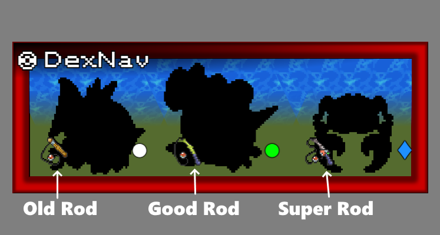

# DexNav User's Manual

Congratulations on your purchase of the Devon T-1616 DexNav module! We hope it is a valuable asset to you on your journey together with your Pokémon.
For the budget-conscious trainer who already has a perfectly fine Pokémon tracking device, you no longer need to invest in a Devon PokéNav. This is a standalone unit that provides the [DexNav](https://bulbapedia.bulbagarden.net/wiki/DexNav) functionality and more!

## Familiarizing yourself with the DexNav display

From the elegant logo, to the vibrant plastic bezel in whatever color you'd like, to the stunning full-color LCD screen, DexNav is there to connect your Pokédex to the world. Your current location is emblazoned on the bottom-right corner of the display, an ever-present reminder of where you are.

But the stylish presentation is just the beginning. Here is an overview of the various modes of operation.

## Modes of Operation

### Encounter Mode

In Encounter Mode, DexNav utilizes the "Area" or "Nest" feature inside your Pokédex to show you all the Pokémon it knows about that are wild in the current area. Only Pokémon that are known to your Pokédex will appear here, so make sure you record every Pokémon you see in battle so DexNav can help you find one of your very own! Pokémon that you have already caught have a completed Pokédex entry, and appear as a full-color picture in the encounter list. Pokémon that you have seen but have not caught have an incomplete Pokédex entry and thus appear here as silhouettes. The skills you learned in the classic childhood game of Who's That Pokémon will come in handy here!

DexNav is also able to determine the relative chances of encountering each of the Pokémon in the area. It surfaces this information to you using the rarity symbols.

#### Rarity

- Ultra Common: More than 50% of encounters will be this Pokémon.
- Common: 50% to 21% of encounters will be this Pokémon.
- Uncommon: 20% to 10% of encounters will be this Pokémon.
- Rare: 9% to 2% of encounters will be this Pokémon.
- Ultra Rare: This Pokémon only has a 1% chance of appearing.

Now of course, this isn't the full story of Pokémon that are available. If a Pokémon is the only one of its kind in the area, as in the case of a Legendary or Mythical Pokémon, the Pokédex will not have the area registered as its nest and DexNav will not know to display it. So keep an eye out!

#### Encounter Groups

- No background: This Pokémon can be encountered in the area's tall grass, or anywhere on the ground if you're in a cave or building.
- Water below: This Pokémon can be encountered by surfing across the water.
- Water above: This Pokémon can be encountered by fishing.

Fishing encounters will tailored to the type of fishing rod(s) you have available. The required rod will be displayed alongside the Pokémon.

DexNav will only show encounter groups available to you. If you don't have a fishing rod, or have yet to earn the badge that allows you to use Surf in your region, fishing encounters or surfing encounters will not be shown. If you have a PokéGear or Pokétch, syncing DexNav to it will limit displayed encounters to only those that are available at the current time of day.

#### Dex Completion Crowns

Our most popular PokéNav feature with trainers trying to "Catch 'em all™" is the collection of [colorful crowns](https://bulbapedia.bulbagarden.net/wiki/DexNav#Mark_of_completion) that will display in the top-right corner of the DexNav screen starting when all of the Pokémon in a single encounter group in the current area have been caught. The T-1616 DexNav has these as well! There are four different crowns in all, with four different meanings.

-  Bronze: All Pokémon in a single encounter group in the area have been caught.
-  Silver: All Pokémon in a two of the encounter groups in the area have been caught.
-  Gold: All Pokémon in all three encounter groups in the area have been caught.
-  Platinum: All Pokémon in the area have been caught. This includes any hidden Pokémon.

In more recent DexNav revisions, the Platinum crown displays next to the Gold crown to make it easier to distinguish from Silver.

### Wild Battle Mode

Upon getting yourself into a battle with a wild Pokémon, DexNav will automatically switch to this screen. At your fingertips is the name of the species you have encountered, its catch rate out of 255, icons representing the Pokémon's type(s), a picture of the Pokémon, and a symbol showing its relative rarity.

As with Encounter Mode, the Pokémon image will be in full color if the Pokédex has registered that species as owned. If you have yet to catch this species, the Pokémon will be show in silhouette as seen above.

The Rarity symbol on this screen takes into account rarity over all encounter groups, not just the one you encountered it from.

#### Type Icons

The 18 standard Pokémon types are represented by these icons:

-  Normal
-  Fire
-  Fighting
-  Water
-  Flying
-  Grass
-  Poison
-  Electric
-  Ground
-  Psychic
-  Rock
-  Ice
-  Bug
-  Dragon
-  Ghost
-  Dark
-  Steel
-  Fairy

### Trainer Battle Mode

If you get into a battle with another Pokémon Trainer, DexNav will automatically switch to this screen. It keeps track of who you're battling against, as well as the state of their party. Any Pokémon the trainer has sent into battle so far will be visible to you. Fainted Pokémon are shown only in silhouette. Party members the opponent has but has not shown to you yet are represented by question marks. The question marks will transform into the Pokémon they represent once that Pokémon joins the fray.

### Unknown Encounters Mode

If you see this screen, that means DexNav has detected that there are wild Pokémon available in the area you're in, but either your Pokédex does not have any information about them, or they are unavailable to you. This tends to happen early on in your journey, or if you enter a place with only water encounters without the ability to fish or surf. In this mode, DexNav shuts off its backlight to conserve power.

### No Encounters Mode

If you see this screen, that means the area you're in is known to have no wild Pokémon encounters. You can walk or surf around without having to worry about being surprised by a wild Pokémon. You'll see this inside most buildings. In this mode, DexNav shuts off its backlight to conserve power.

## And Have Fun!

We hope your DexNav leads the way to your next great discoveries in the world of Pokémon! We thank you for choosing Devon Co., and hope you'll continue to rely on our products for many years to come. Happy catching!